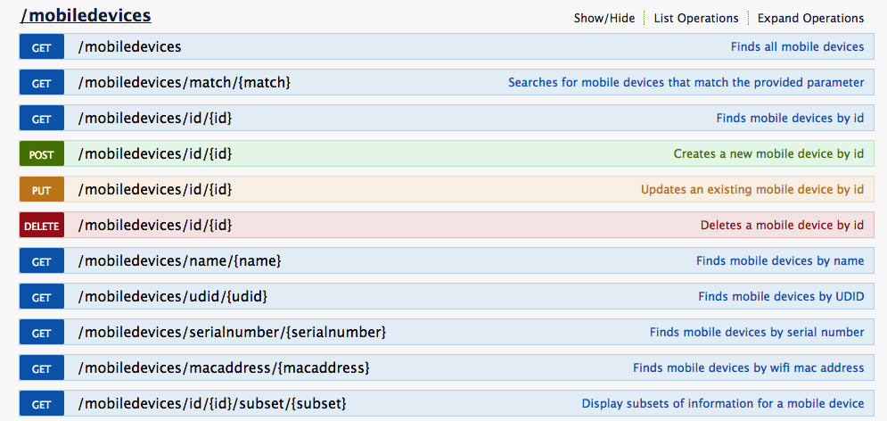
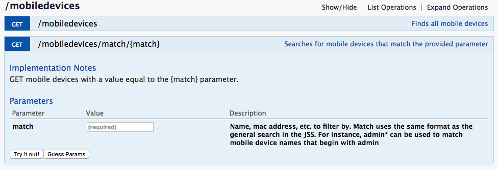

# Getting started with the JSS API
serves as an introduction to the JSS API

Go to https://YOURJSSURL:8443/api

### A list of RESTful API commands



### Clicking on a command gives you further context of the command and lets you test it out


---
## Let's use it to look up a device by asset tag
```
$ curl -H "Accept: application/xml" -su username:password -X GET https://YOURJSSURL:8443/JSSResource/mobiledevices/match/21436
<?xml version="1.0" encoding="UTF-8"?><mobile_devices><size>1</size><mobile_device><id>3271</id><name>Dustin Nikles</name><udid>c5c20b8dd464d74945e6bc13199bc8f82804ad9a</udid><serial_number>DMPRKZ7HG5VW</serial_number><mac_address>70:A2:B3:BD:C3:43</mac_address><wifi_mac_address>70:A2:B3:BD:C3:43</wifi_mac_address><username>dnikles</username><realname>Dustin Nikles</realname><email>dnikles@lebanon.k12.pa.us</email><email_address>dnikles@lebanon.k12.pa.us</email_address><room/><position/><building/><building_name/><department/><department_name/></mobile_device></mobile_devices>
```

## Get additional information by searching on Device ID
```
$ curl -H "Accept: application/xml" -su username:password -X GET https://YOURJSSURL:8443/JSSResource/mobiledevices/id/3271
```
<?xml version="1.0" encoding="UTF-8"?><mobile_device><general><id>3271</id><display_name>Dustin Nikles</display_name><device_name>Dustin Nikles</device_name><name>Dustin Nikles</name><asset_tag>21436</asset_tag><last_inventory_update>Tuesday, January 31 2017 at 11:53 AM</last_inventory_update><last_inventory_update_epoch>1485881606889</last_inventory_update_epoch><last_inventory_update_utc>2017-01-31T11:53:26.889-0500</last_inventory_update_utc><capacity>56526</capacity><capacity_mb>56526</capacity_mb><available>43108</available><available_mb>43108</available_mb><percentage_used>23</percentage_used><os_type>iOS</os_type><os_version>10.2</os_version><os_build>14C92</os_build><serial_number>DMPRKZ7HG5VW</serial_number><udid>c5c20b8dd464d74945e6bc13199bc8f82804ad9a</udid><initial_entry_date_epoch>1464106918469</initial_entry_date_epoch><initial_entry_date_utc>2016-05-24T12:21:58.469-0400</initial_entry_date_utc><phone_number/><ip_address>10.45.48.215</ip_address><wifi_mac_address>70:A2:B3:BD:C3:43</wifi_mac_address><bluetooth_mac_address>70:A2:B3:BD:C3:44</bluetooth_mac_address><modem_firmware/><model>iPad Air 2 (Wi-Fi)</model><model_identifier>iPad5,3</model_identifier><model_number>MGKL2LL</model_number><modelDisplay deprecated="9.4">iPad Air 2 (Wi-Fi)</modelDisplay><model_display>iPad Air 2 (Wi-Fi)</model_display><device_ownership_level>Institutional</device_ownership_level><last_enrollment_epoch>1464108454883</last_enrollment_epoch><last_enrollment_utc>2016-05-24T12:47:34.883-0400</last_enrollment_utc><managed>true</managed><supervised>true</supervised><shared>No</shared><tethered/><battery_level>10</battery_level><ble_capable>true</ble_capable><lost_mode_enabled>false</lost_mode_enabled><lost_mode_enable_issued_epoch>0</lost_mode_enable_issued_epoch><lost_mode_enable_issued_utc/><lost_mode_message/><lost_mode_phone/><lost_mode_footnote/><lost_location_epoch>0</lost_location_epoch><lost_location_utc/></general><location><username>dnikles</username><realname>Dustin Nikles</realname><real_name>Dustin Nikles</real_name><email_address>dnikles@lebanon.k12.pa.us</email_address><position/><phone/><phone_number/><department/><building/><room/></location><purchasing><is_purchased>true</is_purchased><is_leased>false</is_leased><po_number/><vendor/><applecare_id/><purchase_price/><purchasing_account/><po_date/><po_date_epoch>0</po_date_epoch><po_date_utc/><warranty_expires/><warranty_expires_epoch>0</warranty_expires_epoch><warranty_expires_utc/><lease_expires/><lease_expires_epoch>0</lease_expires_epoch><lease_expires_utc/><life_expectancy>0</life_expectancy><purchasing_contact/><attachments/></purchasing><applications><size>28</size><application><application_name>Classroom</application_name><application_version>3033.2</application_version><identifier>com.apple.classroom</identifier></application><application><application_name>Dictation</application_name><application_version>2.0.28</application_version><identifier>com.nuance.Dictation</identifier></application><application><application_name>Dictionary</application_name><application_version>361.0</application_version><identifier>com.m-w.dictionaryipad</identifier></application><application><application_name>DRC INSIGHT</application_name><application_version>7.2.0.1</application_version><identifier>com.drc.wbte-ipad.drc</identifier></application><application><application_name>Drive</application_name><application_version>4.2017.01205</application_version><identifier>com.google.Drive</identifier></application><application><application_name>Excel</application_name><application_version>1.29.17011000</application_version><identifier>com.microsoft.Office.Excel</identifier></application><application><application_name>Google</application_name><application_version>22.0.141836113</application_version><identifier>com.google.GoogleMobile</identifier></application><application><application_name>Google Maps</application_name><application_version>4.27.58</application_version><identifier>com.google.Maps</identifier></application><application><application_name>iTunes U</application_name><application_version>2040</application_version><identifier>com.apple.itunesu</identifier></application><application><application_name>LastPass </application_name><application_version>4.1.7.626</application_version><identifier>com.lastpass.ilastpass</identifier></application><application><application_name>MARIO RUN</application_name><application_version>1157</application_version><identifier>com.nintendo.zara</identifier></application><application><application_name>narwhal</application_name><application_version>2905</application_version><identifier>com.rickharrison.narwhal</identifier></application><application><application_name>Nearpod</application_name><application_version>201612121600</application_version><identifier>com.panareadigital.NearpodTeacher</identifier></application><application><application_name>Netflix</application_name><application_version>918</application_version><identifier>com.netflix.Netflix</identifier></application><application><application_name>OneDrive</application_name><application_version>8.6.1</application_version><identifier>com.microsoft.skydrive</identifier></application><application><application_name>OneNote</application_name><application_version>15030000.17010600</application_version><identifier>com.microsoft.onenote</identifier></application><application><application_name>Ozobot</application_name><application_version>150</application_version><identifier>com.evollve.ozobot</identifier></application><application><application_name>OzoGroove</application_name><application_version>150</application_version><identifier>com.evollve.ozogroove</identifier></application><application><application_name>Pandora</application_name><application_version>1729</application_version><identifier>com.pandora</identifier></application><application><application_name>Plex</application_name><application_version>8874</application_version><identifier>com.plexapp.plex</identifier></application><application><application_name>PowerPoint</application_name><application_version>1.29.17011000</application_version><identifier>com.microsoft.Office.Powerpoint</identifier></application><application><application_name>Schoology</application_name><application_version>19</application_version><identifier>com.schoology.schoology</identifier></application><application><application_name>Self Service</application_name><application_version>16061001</application_version><identifier>com.jamfsoftware.selfservice</identifier></application><application><application_name>Sheets</application_name><application_version>1.2017.02203</application_version><identifier>com.google.Sheets</identifier></application><application><application_name>Slack</application_name><application_version>341465</application_version><identifier>com.tinyspeck.chatlyio</identifier></application><application><application_name>SpeedFlex</application_name><application_version>2.0.7.2</application_version><identifier>com.ruckus.speedflex</identifier></application><application><application_name>SwiftKey</application_name><application_version>160.3.8783001</application_version><identifier>com.swiftkey.SwiftKeyApp</identifier></application><application><application_name>Word</application_name><application_version>1.29.17011000</application_version><identifier>com.microsoft.Office.Word</identifier></application></applications><security><data_protection>false</data_protection><block_level_encryption_capable>true</block_level_encryption_capable><file_level_encryption_capable>true</file_level_encryption_capable><passcode_present>false</passcode_present><passcode_compliant>true</passcode_compliant><passcode_compliant_with_profile>true</passcode_compliant_with_profile><hardware_encryption>3</hardware_encryption><activation_lock_enabled>true</activation_lock_enabled><jailbreak_detected>Normal</jailbreak_detected></security><network><home_carrier_network/><cellular_technology>None</cellular_technology><voice_roaming_enabled>No</voice_roaming_enabled><imei/><iccid/><meid/><current_carrier_network/><carrier_settings_version/><current_mobile_country_code/><current_mobile_network_code/><home_mobile_country_code/><home_mobile_network_code/><data_roaming_enabled>false</data_roaming_enabled><roaming>false</roaming><phone_number/></network><certificates><size>6</size><certificate><common_name>85B94F1D-DF13-4ADF-8CB3-4FAC5E787241</common_name><identity>true</identity></certificate><certificate><common_name>IU13 JSS Built-in Certificate Authority</common_name><identity>false</identity></certificate><certificate><common_name>JSS Built-In Signing Certificate</common_name><identity>true</identity></certificate><certificate><common_name>leader: JSS Built-In Signing Certificate</common_name><identity>true</identity></certificate><certificate><common_name>leader: JSS Built-In Signing Certificate</common_name><identity>false</identity></certificate><certificate><common_name>member: JSS Built-In Signing Certificate</common_name><identity>false</identity></certificate></certificates><configuration_profiles><size>6</size><configuration_profile><display_name>2014-2015 LSD Staff</display_name><version>1</version><identifier>90DAE1BC-99FE-4BF4-B1B4-52BE73CA78E0</identifier><uuid>90DAE1BC-99FE-4BF4-B1B4-52BE73CA78E0</uuid></configuration_profile><configuration_profile><display_name>configurator lock screen message</display_name><version>1</version><identifier>9E5B6983-79A8-4AE4-9EE5-A0F6BA7A0843</identifier><uuid>9E5B6983-79A8-4AE4-9EE5-A0F6BA7A0843</uuid></configuration_profile><configuration_profile><display_name>EDU</display_name><version>1</version><identifier>com.jamfsoftware.education.Profile</identifier><uuid>8FC63C2B-DB97-4158-BCAF-D9AACE2E90C6</uuid></configuration_profile><configuration_profile><display_name>MDM Profile</display_name><version>1</version><identifier>com.jamfsoftware.encrypted-profile-service</identifier><uuid>00000000-0000-0000-A000-4A414D460003</uuid></configuration_profile><configuration_profile><display_name>Staff WiFi</display_name><version>1</version><identifier>d-nikles-21318.local.768892FB-3398-4B29-B2E8-8818FF868886</identifier><uuid>7E226B4D-D300-40E5-8CCE-B5848A08707B</uuid></configuration_profile><configuration_profile><display_name>Staff Wifi</display_name><version>1</version><identifier>55AB2BA2-B48A-4017-8812-C10170712969</identifier><uuid>55AB2BA2-B48A-4017-8812-C10170712969</uuid></configuration_profile></configuration_profiles><provisioning_profiles><size>0</size></provisioning_profiles><mobile_device_groups><size>4</size><mobile_device_group><id>49</id><name>Staff Smart Group</name></mobile_device_group><mobile_device_group><id>2</id><name>All Managed iPads</name></mobile_device_group><mobile_device_group><id>101</id><name>Technology</name></mobile_device_group><mobile_device_group><id>72</id><name>Staff Manually Added</name></mobile_device_group></mobile_device_groups><extension_attributes><extension_attribute><id>6</id><name>Checked-In Comments</name><type>String</type><value/></extension_attribute><extension_attribute><id>5</id><name>Checked-In Condition</name><type>String</type><value>Excellent</value></extension_attribute><extension_attribute><id>4</id><name>Checked-In Date</name><type>Date</type><value>01/26/2017</value></extension_attribute><extension_attribute><id>3</id><name>Checked-In Status</name><type>String</type><value>Checked-Out</value></extension_attribute><extension_attribute><id>1</id><name>Grade</name><type>Number</type><value>District Office</value></extension_attribute><extension_attribute><id>2</id><name>Password</name><type>String</type><value/></extension_attribute><extension_attribute><id>8</id><name>Previous Owner</name><type>String</type><value/></extension_attribute></extension_attributes>
```
